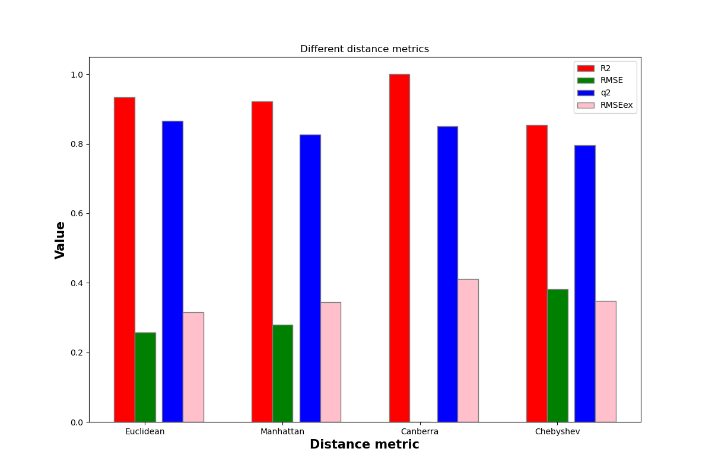
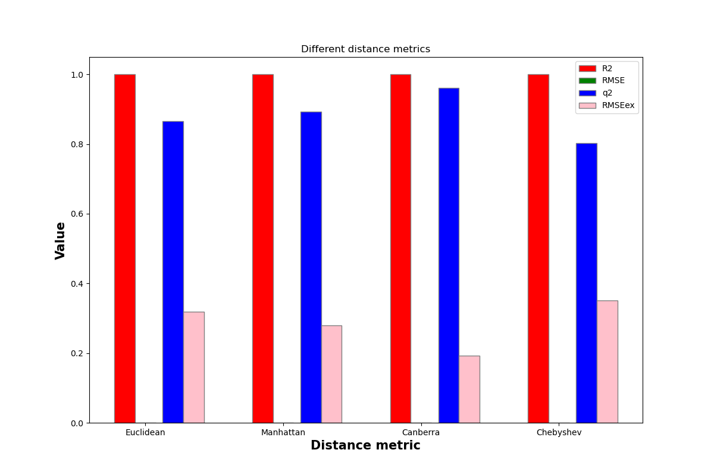

# K-Nearest-Neighbors | Szymon Mirczak

## Uruchomienie programu:
Przed uruchomieniem programu należy zrobić 2 foldery:
* Jeden, "./KNN/" w którym należy umieścić program
* Drugi, "./figures", w którym zapisywane będą wykresy
* Oba foldery należy umieścić w jednym miejscu na dysku

Następnie wystarczy w terminalu odpalić
''python3 ./KNN/KNN.py''

## Najważniejsze funkcje
* zadanie1(file_path):
* zadanie2(file_path):

parametr 'file_path' w razie potrzeby należy zmienić w '390' lini kodu

-# porównanie statystyk dla różnych miar odległości w "Klasycznym" KNN
Widząc, że odległość Manhattan posiada zarówno najwyższy współczynnik R2 oraz Q2 to możemy uznać, że najlepszą miarą odległości dla tego zestawu danych będzie właśnie odległość Manhattan

-# porównanie statystyk dla różnych miar odległości w "Ważonym" KNN
Widząc, że przy użyciu wszystkich miar odległości współczynnik '''R2 = 1.0''' a '''RMSE = 0.0'''. Uznamy, że model ważony jest przeuczony w przypadku wszystkich użytych miar odległości i nie nadaje się do poprawnej klasyfikacji

# Pozostałe wykrezy znajdują się w folderze /figures

### Szymon Mirczak
