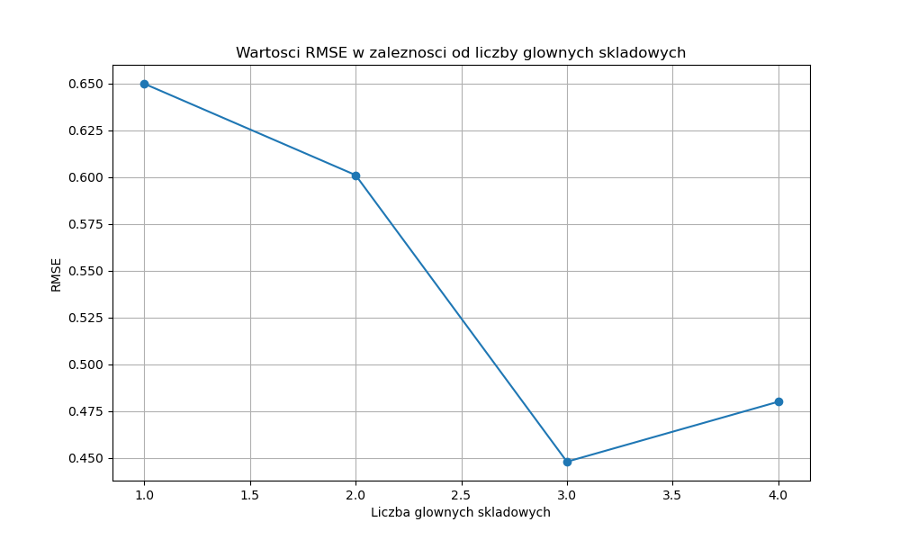
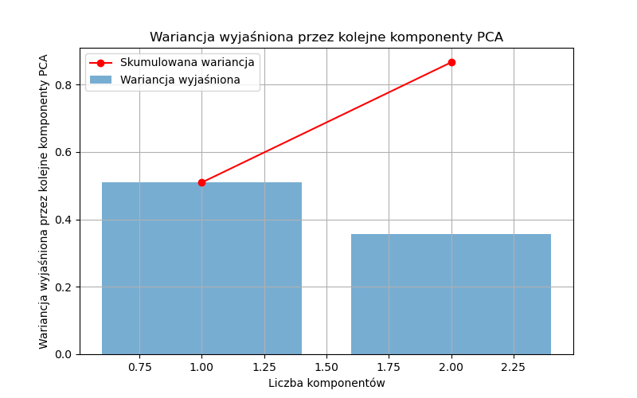

# PCR | Szymon Mirczak

[^1] parametr 'file_path' w razie potrzeby należy zmienić w '390' lini kodu

Wartość RMSE osiąga najniższy punkt przy trzech głównych składowych. Oznacza to, że model najlepiej odwzorowuje dane przy użyciu trzech komponentów, co sugeruje, że jest to optymalna liczba składowych do utrzymania dobrego balansu pomiędzy jakością predykcji a złożonością modelu.

Wariancja wyjaśniona przez główne składowe przekracza próg 80% przy dwóch komponentach. Oznacza to, że dwie pierwsze składowe główne w pełni wyjaśniają ponad 80% zmienności w danych, co potwierdza ich dominującą rolę w modelu. Dzięki temu możemy zastosować redukcję wymiarów, zachowując jednocześnie większość informacji, co prowadzi do uproszczenia modelu bez utraty jego skuteczności.

# Pozostałe wykrezy znajdują się w folderze /figures

### Szymon Mirczak
